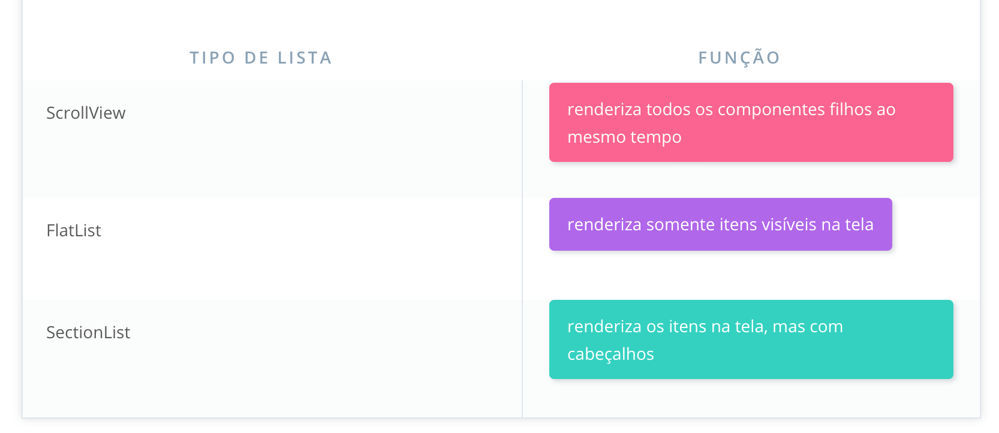
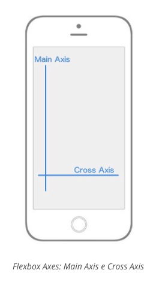

# React Native #

## Instalando o Create React Native App ##

Para utilizar o Create React Native App, instale-o integralmente uma única vez:

```
npm install -g create-react-native-app
```

## Como alternativa ao npm, você poderá utilizar o yarn (acesse aqui para ver as instruções de configuração): ##

```
yarn global add create-react-native-app
```

# Expo #

O Expo é um serviço que torna quase tudo que envolve o React Native bem mais fácil. A ideia por trás do Expo é não haver nenhuma necessidade de usar Android Studio ou Xcode. O melhor: ele ainda nos permite desenvolver para iOS com Windows (ou até mesmo Linux)!

Com o Expo, você pode carregar e executar projetos construídos com Create React Native App com o mesmo JavaScript que já conhece. Não há nenhuma necessidade de compilar qualquer código nativo. E, quase da mesma forma que o Create React App, usar o Expo com Create React Native App nos permite colocar um aplicativo em funcionamento com quase nenhuma configuração.

Contaremos muito com o Expo durante este curso. Antes de qualquer coisa: você precisa instalar o Expo. Vá até a loja de apps de seu dispositivo e instale o app móvel Expo:

Expo no Google Play (Android) (https://play.google.com/store/apps/details?id=host.exp.exponent)
Expo na App Store (iOS) (https://itunes.apple.com/us/app/expo-client/id982107779)


# Debugando #

Para debugar vc precisa entrar nas configurações do Expo para isso utilize os comandos: 

1. **CMD+D** no emulador do IOS
2. **CMD+M** no emulador do Android
3. No aparelho basta agitar


# ScrollView

Super simples de usar porem com problema que sempre será carregada toda a lista sendo assim ele não é muito eficaz.

# FlatList

Igual ao ScrollView porem com mais performance pois o mesmo só carrega a lista que o usuário consegue ver e não a lista toda.

[Doc](https://facebook.github.io/react-native/docs/flatlist.html)

# SectionList 
E se você quisesse adicionar cabeçalhos de seção em uma lista? FlatList não suporta muito bem isso, mas o React Native oferece um outro componente de lista que renderiza esses cabeçalhos facilmente. Fique à vontade de checar o componente [SectionList](https://facebook.github.io/react-native/docs/sectionlist.html) na documentação do React Native para conferir em mais detalhes




# Fazendo com que o teclado não sobrescreva alguma view como por exemplo o InputText:

Para isso basta substituir o **<View>** por **<KeyboardAvoidingView>** porem adicionar um comportamento de como deve ser feito esse espacamento para isso utilize a propriedade:

 **behavior** com as opções:

 1. height
 2. position
 3. padding

 ex:

```javascript
 <KeyboardAvoidingView behavior='padding'>
  ...
 </KeyboardAvoidingView>
```


# AsyncStorage 

[Documentação](https://facebook.github.io/react-native/docs/asyncstorage.html)

### Observação

AsyncStorage é um sistema de armazenamento simples, sem criptografia, assíncrono, persistente e fundamental, usado em todo o aplicativo. Ele deve ser usado em vez de LocalStorage.

# Styles 

Em apps react-native os estilos são implementados dentro dos componentes e não em arquivos CSS

```javascript
StyleSheet.create({
  container: {
    flex: 1,
    color: red
  }
})
```

Utilizando o **StyleSheet** o react-native otimiza seu css.

# Flexbox 

## Conceito utilizado pelo react-native como um padrão para construir layouts

## Flexbox Axes (Eixos do flexbox)

De longe, o conceito mais importante para se entender do flexbox é que ele trabalha com diferentes axes ou, em português, eixos. Você terá um Main Axis e um Cross Axis.



No React Native, por padrão, o Main Axis é vertical, enquanto o Cross Axis é horizontal. Todos os outros conceitos do flexbox são baseados neste conceito de um Main Axis e Cross Axis.

Quando eu digo "... irá alinhar todos os elementos-filhos ao longo do Main Axis", isso significa que, por padrão, todos os filhos do elemento-pai serão dispostos verticalmente, de cima para baixo. Quando eu digo "... irá alinhar todos os elementos-filhos ao longo do Cross Axis", isso significa que, por padrão, todos os filhos do elemento-pai serão dispostos horizontalmente, da esquerda para a direita.

O resto do flexbox trata-se apenas de decidir como você deseja alinhar, posicionar, esticar, espalhar, encolher, centralizar e agrupar elementos-filhos ao longo do Main e do Cross axis.


## Flex direction

Note que eu deixei bem claro o termo "padrão" no que diz respeito ao Main Axis e ao Cross Axis. Isso é porque você pode alterar qual Axis é o Main e qual é o Cross. Isso nos leva à primeira propriedade do flexbox, flex-direction (ou flexDirection, no React Native).

**flex-direção** tem dois valores:

* row
* column

Por padrão, cada elemento do React Native tem o flexDirection: column declarado. Quando um elemento tem uma flex-direction de column, seu Main axis é vertical e seu Cross axis é horizontal, assim como vimos na imagem acima. No entanto, se você der a um elemento uma flexDirection: row, os eixos desse elemento irão alternar. O Main axis se torna o horizontal, enquanto o Cross axis se torna o vertical. Isso é muito importante, pois todo o seu layout depende desses dois eixos (axis).


## Justify content

Agora as coisas começam a ficar divertidas. Vamos ver melhor as diferentes propriedades e valores que podem ser utilizadas para alinhar elementos-filhos ao longo desses axes. Primeiro, vamos focar inteiramente no Main axis.

Para especificar como os filhos se alinham ao longo do Main Axis, você utilizará a propriedade justifycontent. justifycontent possui cinco valores diferentes que você pode utilizar para modificar como os elementos-filhos se alinham ao longo do Main Axis.

* flex-start
* center
* flex-end
* space-around
* space-between


Se você quiser acompanhar (o que eu recomendo muito que você faça), crie um novo projeto React Native chamado "FlexboxExamples" e troque seu código 'App.js' pelo seguinte:

```javascript
import React, { Component } from 'react'
import { StyleSheet, Text, View, AppRegistry } from 'react-native'

class FlexboxExamples extends Component {
  render() {
    return (
      <View style={styles.container}>
        <View style={styles.box}/>
        <View style={styles.box}/>
        <View style={styles.box}/>
      </View>
    )
  }
}

const styles = StyleSheet.create({
  container: {
    flex: 1,
  },
  box: {
    height: 50,
    width: 50,
    backgroundColor: '#e76e63',
    margin: 10,
  }
})

```

Observe que, com o código acima, a única coisa que vai mudar é o estilo no objeto de container do objeto styles contido no StyleSheet. Ignore flex: 1 por enquanto.

## Justify Content: Flex-Start

justifyContent: flex-start faz os itens flex aparecerem no começo de Main Axis.
justifyContent: 'flex-start' irá alinhar cada elemento-filho para o início do Main Axis.

```
container: {
  flex: 1,
  justifyContent: 'flex-start',
}

```

Se você ainda estava tendo problemas com a importância do Main Axis e do Cross Axis, espero que agora eles façam sentido. Como o padrão de flexDirection é column e estamos usando justifyContent, que tem como alvo principal Main Axis, nossos elementos-filhos vão se alinhar no início do main axis, que é o canto superior esquerdo, e ir descendo a partir dali.

## Justify Content: Center

justifyContent: center faz com que os flex items apareçam no centro do Main Axis.  
justifyContent: 'center' irá alinhar cada elemento-filho em direção ao centro do Main Axis. ​

```
container: {
  flex: 1,
  justifyContent: 'center',
}

```

##Justify Content: Flex-End

justifyContent: flex-end faz com que os flex items apareçam no fim do Main Axis.  
justifyContent: 'flex-end' irá alinhar cada elemento-filho em direção ao fim do Main Axis. ​

```
container: {
  flex: 1,
  justifyContent: 'flex-end',
}

```

## Justify Content: Space-Between

justifyContent: space-between flex items irão aparecer nos dois extremos do Main Axis, com um espaço entre eles.  
justifyContent: 'space-between' irá alinhar cada filho para que o espaço entre eles seja o mesmo ao longo do Main Axis. ​

```
container: {
  flex: 1,
  justifyContent: 'space-between',
}
```

## Justify Content: Space-Around

justifyContent: space-around os flex items são separados com uma mesma distância ao longo do Main Axis.  
justifyContent: 'space-around' irá alinhar cada elemento-filho para que haja o mesmo espaço em torno dos items ao longo do Main Axis. ​


```
container: {
  flex: 1,
  justifyContent: 'space-around',
}
```

Mudando o flexDirection para row as view ficarão lado a lado e não uma em cima da outra: 


```
container: {
  flex: 1,
  flexDirection: 'row',
  justifyContent: 'space-around',
}
```

justifyContent: space-around com flex-direction: row modifica o Main Axis para horizontal com espaço ao redor dos itens flex.  

Observe que tudo o que mudou foi o valor do flexDirection, e isso alterou drasticamente nosso layout. Agora, você está começando a ver o verdadeiro poder do flexbox.

## Align Items (O Cross Axis)

Agora, vamos colocar nosso foco inteiramente no Cross Axis. Para especificar como os filhos se alinham ao longo do Cross Axis, você usaria a propriedade align-items.

Você poderia pensar que alignItems possui o mesmo valor de justifyContent. É uma suposição razoável, mas você estaria errado. Essa propriedade tem quatro valores diferentes que você pode usar para alterar como os elementos-filhos se alinham com relação ao Cross Axis.

* flex-start
* center
* flex-end
* stretch


alignItems: 'flex-start' irá alinhar cada elemento-filho em direção ao início do Cross Axis. ​

```
container: {
  flex: 1,
  alignItems: 'flex-start',
}

```

## Align Items: Center

alignItems: center faz com que os flex items apareçam no meio do Cross Axis.  
alignItems: 'center' alinhará cada elemento-filho em direção ao centro do Cross Axis. ​

```
container: {
  flex: 1,
  alignItems: 'center',
}

```

## Align Items: Flex-End

alignItems: flex-end faz com que os flex items apareçam no fim do Cross Axis.  
alignItems: 'flex-end' alinhará cada elemento filho ao final do Cross Axis. ​

```
container: {
  flex: 1,
  alignItems: 'flex-end',
}
```

## Align Items: Stretch

alignItems: stretch faz com que os flex items ocupem toda a largura do Cross Axis.  
alignItems: 'stretch' irá esticar cada elemento-filho ao longo do Cross Axis, contanto que o elemento-filho não tenha uma largura (flexDirection: row) ou altura (flexDirection: column) especificada. ​

```javascript
container: {
  flex: 1,
  alignItems: 'stretch',
},
box: {
  height: 50,
  backgroundColor: '#e76e63',
  margin: 10,
}
```

Bem na hora que achou que estava aprendendo, o flexbox dá um susto em você. Toda vez que você configurar alignItems para stretch, cada elemento-filho irá esticar até a largura total ou altura total do contêiner-pai desde que este elemento-filho não possua largura ou altura. Note que, no box styling, eu removi a propriedade width: 50, pois flexDirection está configurado para column por padrão, o que significa que os flex items serão esticados horizontalmente (uma vez que estamos usando alignItems).


[Link completo sobre Flexbox](https://css-tricks.com/snippets/css/a-guide-to-flexbox/)


# Platform

Para customizar algo para um aplicativo android ou ios usamos da seguinte forma :

```javascript
import {Platform} from 'react-native';

{Platform.OS === 'ios'
  ? <Ionicons name='ios-pizza' />
  : <Ionicons name='md-pizza' />
}
```


# API Dimensions 

O React Native também vem com Dimensions, que permite que você selecione a largura e a altura da janela no dispositivo do usuário!

Primeiro, tenha certeza de que você importou a API do React Native:

```
import { Dimensions } from 'react-native';

```

Em seguida, você pode simplesmente recuperar o tamanho da tela através do método get da API Dimensions:

```
const { width, height } = Dimensions.get('window');
```

# Framework para trabalhar com styles de forma diferente

[Styled-Components](https://github.com/styled-components/styled-components)

ex: 

```javascript
const Title = styled.h1`
    font-size: 1.5em;
    text-align: center;
    color: palevioletred;
    animation: ${keyframes`from { opacity: 0; }`} 1s both;
`;

<Title>Titulo</Title>
```

# React Navigation for React-Native

## Instalando: 

```
yarn add react-navigation
```

## TabNavigator


Exemplo: 

```javascript

Import { TabNavigator } from 'react-navigation';

const Hello = () => (
  <View>
    <Text>Hello!</Text>
  </View>
);

const Goodbye = () => (
  <View>
    <Text>Goodbye!</Text>
  </View>
);

const Tabs = TabNavigator({
  Hello: {
    screen: Hello
  },
  Goodbye: {
    screen: Goodbye
  },
});


export default class App extends React.Component {
  render() {
    return (
      <Tabs />
    );
  }
}
```


Dentro do objeto, cada par de chave e valor representa uma única aba. As chaves representam o nome da aba; e isso é o que os usuários verão ao pressioná-las. Observe que uma propriedade screen também está incluída; este é o componente gerado quando a aba está ativa.

## StackNavigator 

Ao pressionar um item, como um modo de exibição de índice, esperamos ir para uma nova tela com detalhes sobre esse item. O React Navigation oferece outro navegador para isso! Com o Stack Navigator, novas telas são adicionadas e removidas como uma pilha. Isso coloca telas em cima umas da outras, de maneira que "a última que entra é a primeira que sai", semelhante aos métodos push() e pop() de Array.

O uso de StackNavigator é muito semelhante ao de TabNavigator. Mas, em vez de passar em um objeto de abas diferentes, podemos passar um objeto de telas diferentes, que devem estar disponíveis em toda essa pilha. Primeiro, vá em frente e faça a importação do StackNavigator a partir de react-navigation.

Exemplo: 

Todo componente controlado pelo navigationTabs recebe no props o objeto navigation e nele podemos receber parametros

recuperamos esse parametro da seguinte forma: 

```javascript
this.props.navigation.state.params.entryID

```

Podemos customizar o StackNavigator dentro da classe que vai ser renderizada basta adicionar uma variavel:

```javascript
static navigationOptions = ({navigation} => {
  return {
    title: 'Pagina X'
  }
}) 

```


```javascript
Import { StackNavigator } from 'react-navigation';

const Home = ({ navigation }) => (
  <View>
    <Text>This is the Home view</Text>
    <TouchableOpacity onPress={() => navigation.navigate('Dashboard', {entryID: '1'})}>
      <Text>Press here for the Dashboard</Text>
    </TouchableOpacity>
  </View>
);

const Dashboard = () => (
  <View>
    <Text>Este é o Dashboard</Text>
  </View>
);

const Stack = StackNavigator({
  Home: {
    screen: Home
  },
  Dashboard: {
    screen: Dashboard
  }
})

export default class App extends React.Component {
  render() {
    return (
      <Stack />
    );
  }
}

```
# StatusBar

O expo disponibiliza algumas constantes: 

```javascript
import { Constants } from 'expo';

<View style={{height: Constants.statusBarHeight}}>
```

# Animações:

## Atenção: Animações

Assim que você compreender totalmente a API do Animated, um novo mundo se abrirá para você. Parece ótimo, mas isso pode ser uma espada de dois gumes. É algo bom, pois agora você tem a capacidade de melhorar a sensação do seu aplicativo com animações. No entanto, com grandes poderes vem grandes responsabilidades.

O objetivo de ter animações é melhorar a experiência do usuário, não distraí-lo dela. Se tiver isso em mente sempre que adicionar animações a seu aplicativo, ele terá um melhor desempenho e o risco de arruinar a experiência do usuário com animações desnecessárias será minimizado.


# scheduleLocalNotificationAsync

## Notificações

